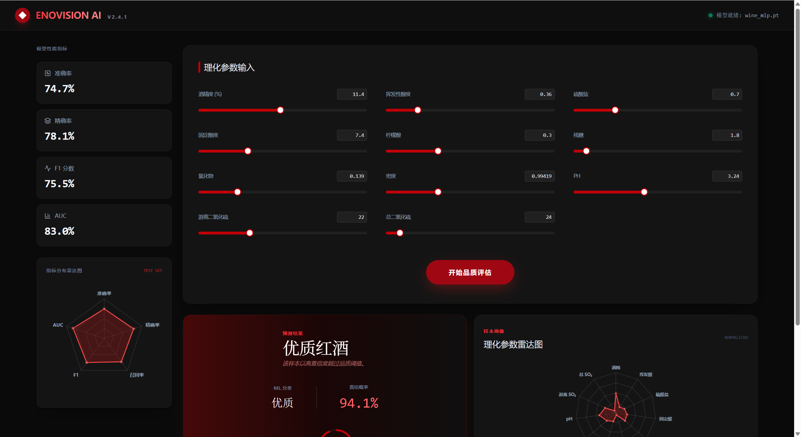
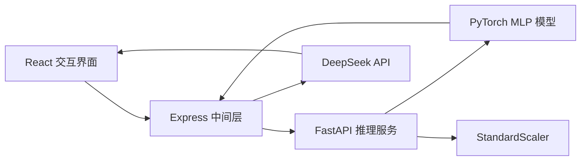

# Vinum AI · 红酒品质智能评估系统

> 一个融合机器学习预测、数据可视化与大模型品鉴建议的全栈 AI 项目。

Vinum AI 以红酒的 11 项理化参数为输入，通过 PyTorch 神经网络判断样本是否达到优质红酒标准，并使用雷达图解释模型性能与样本特征。完成预测后，系统还可以调用 DeepSeek，根据化学指标和模型结果生成自然语言品鉴与餐酒搭配建议。

这个项目不仅实现了“训练一个模型”，还覆盖了数据处理、模型评估、API 服务、交互界面、AI 能力接入、自动化测试和容器化配置，形成了可以实际运行和演示的完整产品闭环。

## 项目演示

### 1. 输入理化指标，快速完成品质分类

用户可以通过滑块或数字输入调整酒精度、酸度、残糖、pH、硫酸盐等 11 项指标。界面同步展示测试集模型指标，并将 Accuracy、Precision、Recall、F1 和 AUC 汇总为性能雷达图。



系统会返回“优质红酒”或“普通红酒”的分类结果，并展示样本属于优质类别的模型输出概率。预测结果旁的理化参数雷达图会把不同量纲的指标归一化，帮助用户直观看到当前样本的化学特征轮廓。

### 2. 对普通样本给出清晰、可解释的结果

同一套交互流程也适用于普通红酒样本。系统不会只显示一个标签，而是同时呈现优质类别概率和当前样本画像，让预测结果更容易理解。


### 3. 结合 DeepSeek 生成 AI 品酒建议

在机器学习预测的基础上，用户可以进一步请求 AI 侍酒师分析。DeepSeek 会结合具体理化参数、分类结果和模型输出概率，生成关于口感、结构、香气及餐酒搭配的中文建议。


## 我在项目中完成了什么

- **机器学习建模**：使用 PyTorch 搭建包含 BatchNorm、ReLU 和 Dropout 的多层感知机，完成红酒品质二分类。
- **可信训练流程**：采用分层的训练集、验证集、测试集划分；验证集负责选择最佳 F1 模型，测试集只用于最终评估。
- **可复现性控制**：统一设置 Python、NumPy、PyTorch 与 DataLoader 随机种子，并仅使用训练集拟合 StandardScaler。
- **全栈产品实现**：使用 FastAPI 提供推理与指标接口，使用 React + TypeScript 构建可交互的预测控制台。
- **数据可视化**：通过 Recharts 展示模型性能雷达图和 11 项理化参数雷达图。
- **大模型能力接入**：通过 Express 中间层调用 DeepSeek API，将结构化预测结果转化为易读的品鉴建议。
- **工程质量建设**：增加输入范围校验、前端异常处理、pytest、Ruff、GitHub Actions、Dockerfile 与 Docker Compose。

## 模型效果

当前仓库内模型使用独立测试集评估，指标文件与保存的最佳模型来自同一次训练流程。

| 指标 | 测试集结果 | 说明 |
|---|---:|---|
| Accuracy | 74.7% | 所有样本中预测正确的比例 |
| Precision | 78.1% | 预测为优质的样本中，实际为优质的比例 |
| Recall | 73.1% | 实际优质样本中，被模型识别出来的比例 |
| F1 | 75.5% | Precision 与 Recall 的综合表现 |
| AUC | 83.0% | 模型区分优质与普通样本的整体能力 |

> 界面中的概率表示模型输出的“优质类别概率”，分类阈值为 50%。它用于表达模型倾向，不等同于经过严格概率校准后的现实发生概率。

## 技术架构



| 模块 | 技术选型 |
|---|---|
| 前端 | React 19、TypeScript、Tailwind CSS 4、Motion、Recharts、Radix UI |
| 中间层 | Express、Vite、TypeScript |
| 后端 | FastAPI、Pydantic、Uvicorn |
| 机器学习 | PyTorch、scikit-learn、pandas、NumPy、joblib |
| AI 品鉴 | DeepSeek API（OpenAI 兼容接口） |
| 工程化 | pytest、Ruff、GitHub Actions、Docker Compose |

## 项目结构

```text
WineQualityPredictor/
├── backend/
│   ├── data/                 # 红酒数据集
│   ├── src/                  # 数据处理、模型、训练、评估和 FastAPI 服务
│   ├── tests/                # 后端自动化测试
│   ├── metrics.json          # 最佳模型在独立测试集上的指标
│   └── Dockerfile
├── frontend/
│   ├── src/                  # React 界面与类型定义
│   ├── server.ts             # API 代理与 DeepSeek 接入
│   └── Dockerfile
├── .github/workflows/ci.yml  # 自动化检查与构建
├── docker-compose.yml
└── start.bat                 # Windows 一键启动
```

## 快速体验

### Windows 一键启动

准备 Python 3.9+ 和 Node.js 18+，双击运行：

```text
start.bat
```

脚本会自动检查依赖、按需训练模型、启动后端并验证健康状态，随后在 `http://localhost:3000` 提供前端页面。

如需使用 AI 品鉴功能，请复制 `frontend/.env.example` 为 `frontend/.env`，并填写：

```env
DEEPSEEK_API_KEY=your_api_key_here
```

### 手动启动

```powershell
# 后端
cd backend
python -m venv venv
venv\Scripts\activate
pip install -r requirements.txt
python -m src.train
python -m uvicorn src.main:app --host 0.0.0.0 --port 8000

# 前端（新终端）
cd frontend
npm install
npm run dev
```

### Docker Compose

```bash
docker compose up --build
```

## 工程质量

```bash
# 后端测试与代码检查
cd backend
pytest -q
ruff check src tests

# 前端类型检查与生产构建
cd frontend
npm run lint
npm run build
```

GitHub Actions 会在 push 和 pull request 时自动执行上述核心检查。

## 项目价值

Vinum AI 展示了我将算法能力转化为可交互产品的完整实践：从数据划分和模型选择，到 API 设计、输入校验、可视化表达，再到大模型集成与工程化交付。相比只停留在 Notebook 中的模型实验，这个项目更关注结果是否可信、用户是否看得懂，以及系统能否稳定运行和持续维护。

## License

本项目基于 [MIT License](./LICENSE) 开源。
