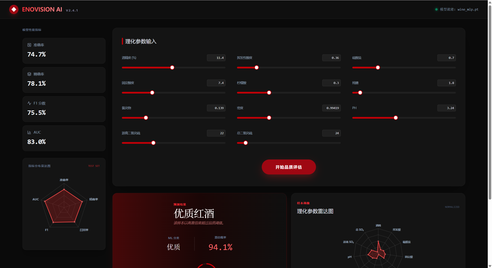
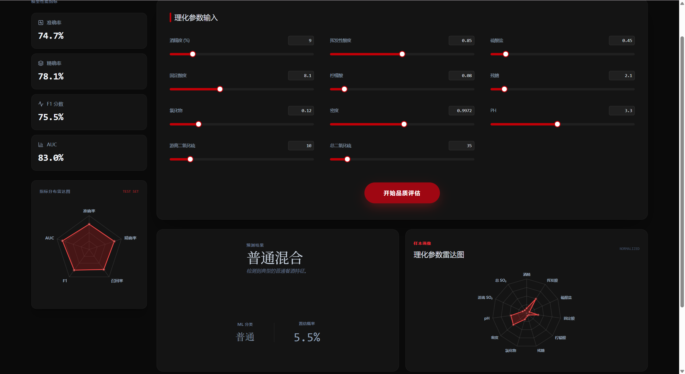
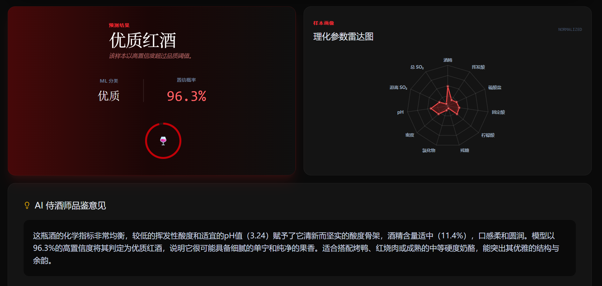
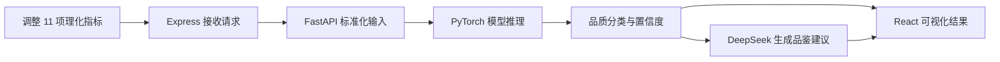

# Vinum AI｜红酒品质预测与 AI 品鉴系统

> 将机器学习预测、可视化分析与生成式 AI 解释整合为一套可交互的红酒品质分析体验。

Vinum AI 以红酒的 11 项理化指标为输入，通过 PyTorch 神经网络判断样本属于“标准品质”还是“优质”，并使用 DeepSeek 将模型结果转化为易于理解的品鉴与餐食搭配建议。项目覆盖数据处理、模型训练、推理服务、Web 交互和大模型接入，展示了从模型实验到可用产品的完整落地过程。

## 项目概览

| 项目维度 | 说明 |
| --- | --- |
| 项目类型 | 机器学习 / 生成式 AI / 全栈 Web 应用 |
| 核心场景 | 根据红酒理化指标预测品质，并生成可读的专业解释 |
| 模型能力 | PyTorch 多层感知机二分类模型（原始质量评分 ≥ 6 记为优质） |
| 产品形态 | React 交互式控制台 + FastAPI 推理服务 |
| AI 能力 | DeepSeek API 生成品鉴意见与餐食搭配建议 |
| 当前结果 | Accuracy 75.94%，F1 77.81%，AUC 85.66% |

## 产品体验

### 理化参数控制台

用户可以通过滑块调整酒精度、酸度、残糖、pH 等 11 项理化指标。页面左侧同步展示测试集指标，让预测结果与模型整体表现处于同一阅读上下文中。



### 品质预测与指标画像

提交参数后，系统会展示品质分类、预测置信度和归一化指标雷达图，帮助用户同时理解模型结论与当前样本特征。



### AI 辅助品鉴解读

DeepSeek 根据样本指标与预测结果生成展示性的口感描述和餐食搭配建议，将机器学习输出转换为非技术用户更容易理解的语言。



> AI 生成内容仅用于功能演示，不构成专业品酒、质量鉴定、消费或健康建议。

完整处理流程如下：



## 核心能力

### 品质预测

- 基于公开红酒质量数据训练二分类神经网络
- 对 11 项输入特征应用训练阶段保存的标准化器
- 返回预测标签与概率，前端同步展示置信度
- 模型与预处理器保存为独立产物，服务启动时自动加载

### 可视化分析

- 使用滑块降低理化参数的输入门槛
- 使用雷达图呈现多维指标特征
- 在同一页面展示预测结果、置信度和模型指标
- 通过 Motion 提供清晰、克制的交互反馈

### AI 品鉴

- 将理化指标和模型结论组合为结构化上下文
- 通过 DeepSeek 生成口感、结构与餐食搭配建议
- API Key 仅保存在服务端环境变量中，避免暴露在浏览器
- 将“模型判断”与“自然语言解释”分离，便于独立替换和维护

## 模型表现

模型使用 UCI Wine Quality 红酒数据中的 1,599 条样本，以原始质量评分 `>= 6` 作为正类；数据按固定随机种子划分为 80% 训练集和 20% 测试集。当前仓库中 `backend/metrics.json` 保存的测试集结果如下：

| 指标 | 结果 | 含义 |
| --- | ---: | --- |
| Accuracy | 75.94% | 全部样本中预测正确的比例 |
| Precision | 80.36% | 被判断为优质的样本中实际为优质的比例 |
| Recall | 75.42% | 实际优质样本中被模型识别出的比例 |
| F1 Score | 77.81% | Precision 与 Recall 的综合表现 |
| AUC | 85.66% | 模型区分两类样本的整体能力 |

> 当前结果来自一次固定划分，尚未进行交叉验证或与基线模型系统对比；指标用于展示实验结果，不代表该模型可替代专业品酒或质量检验。

## 技术方案

| 层级 | 技术 | 职责 |
| --- | --- | --- |
| Web 前端 | React 19、TypeScript、Vite | 参数交互与预测结果展示 |
| UI / 图表 | Tailwind CSS 4、Radix UI、Recharts、Motion | 响应式界面、图表与动效 |
| 应用中间层 | Express | API 代理、环境变量管理与 AI 服务调用 |
| 推理服务 | FastAPI、Pydantic | 输入校验、指标读取与模型推理接口 |
| 机器学习 | PyTorch、scikit-learn | 模型训练、特征标准化与评估 |
| 生成式 AI | DeepSeek API | 展示性品鉴解读与搭配建议生成 |

## 实现亮点

1. **端到端模型落地**：训练脚本输出模型、标准化器和评估指标，FastAPI 在启动时加载产物并提供稳定的推理接口。
2. **双层解释体验**：概率与模型指标提供量化依据，AI 侍酒师负责将结果转换成非技术用户可理解的语言。
3. **前后端职责清晰**：浏览器负责交互，Express 统一代理业务请求，Python 服务专注模型推理。
4. **配置安全**：模型服务地址和 DeepSeek 凭据通过环境变量读取，不写入前端代码。

## 我在项目中完成的工作

- 完成数据读取、预处理、模型定义、训练与评估流程
- 将训练后的 PyTorch 模型封装为 FastAPI 推理服务
- 设计 React 控制台、参数交互和数据可视化
- 搭建 Express 中间层并接入 DeepSeek API
- 编写 Windows 一键启动脚本，串联前后端运行流程

## 本地运行

### 环境要求

- Python 3.9+
- Node.js 18+
- DeepSeek API Key（仅 AI 品鉴功能需要）

### 1. 启动模型服务

```powershell
cd backend
python -m venv venv
.\venv\Scripts\Activate.ps1
pip install -r requirements.txt

# 如需重新训练模型
python -m src.train

uvicorn src.main:app --host 0.0.0.0 --port 8000
```

### 2. 启动 Web 应用

```powershell
cd frontend
Copy-Item .env.example .env
# 在 .env 中填写 DEEPSEEK_API_KEY
npm install
npm run dev
```

访问 `http://localhost:3000`。Windows 用户也可以直接运行根目录下的 `start.bat`。

## 工程结构

```text
WineQualityPredictor/
├── backend/
│   ├── data/              # 红酒质量数据集
│   ├── src/               # 训练、评估与 FastAPI 推理服务
│   ├── metrics.json       # 模型评估结果
│   └── wine_quality_mlp.pt
├── frontend/
│   ├── src/               # React 页面与组件
│   └── server.ts          # Express 中间层与 AI 品鉴接口
├── start.bat              # Windows 一键启动脚本
└── README.md
```

## 当前边界

- 当前模型针对仓库内红酒数据集进行二分类，不覆盖其他酒种或生产环境数据漂移。
- AI 品鉴内容用于产品展示，不构成专业鉴定、消费或健康建议。
- 后续可补充交叉验证、混淆矩阵、特征贡献分析与模型版本管理。

## 开源许可

本项目基于 [MIT License](LICENSE) 开源。
